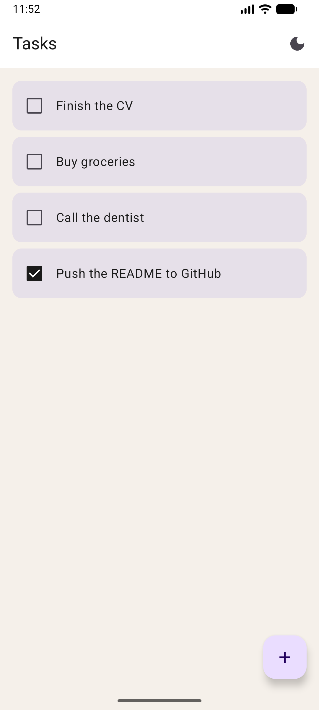
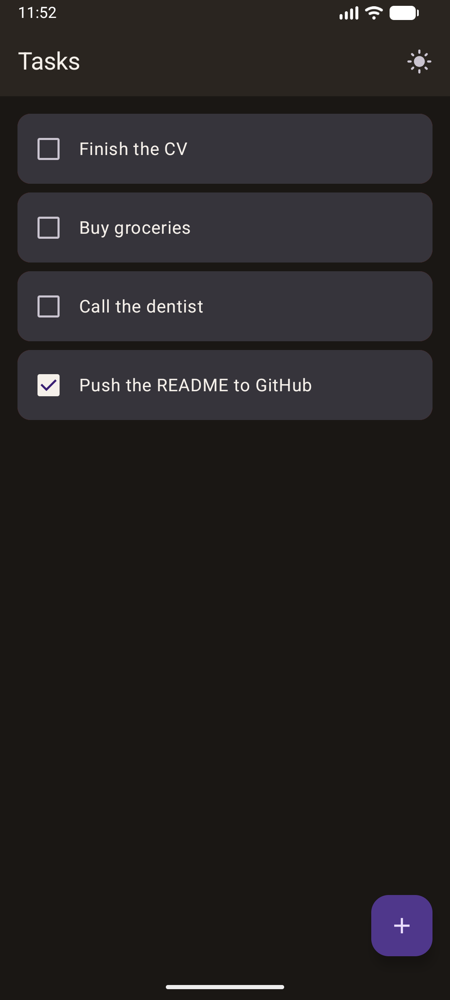
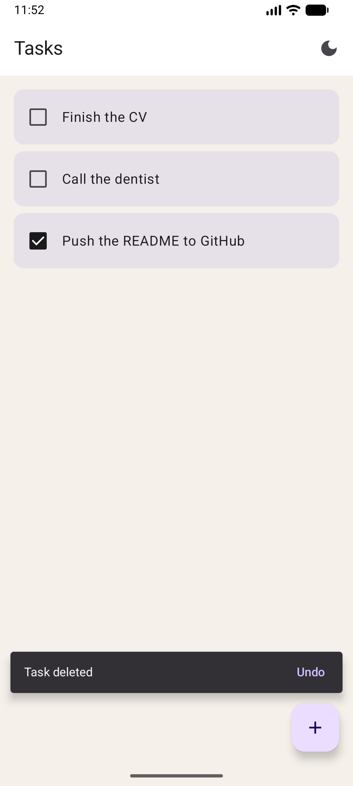
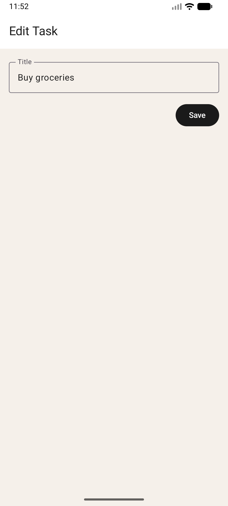
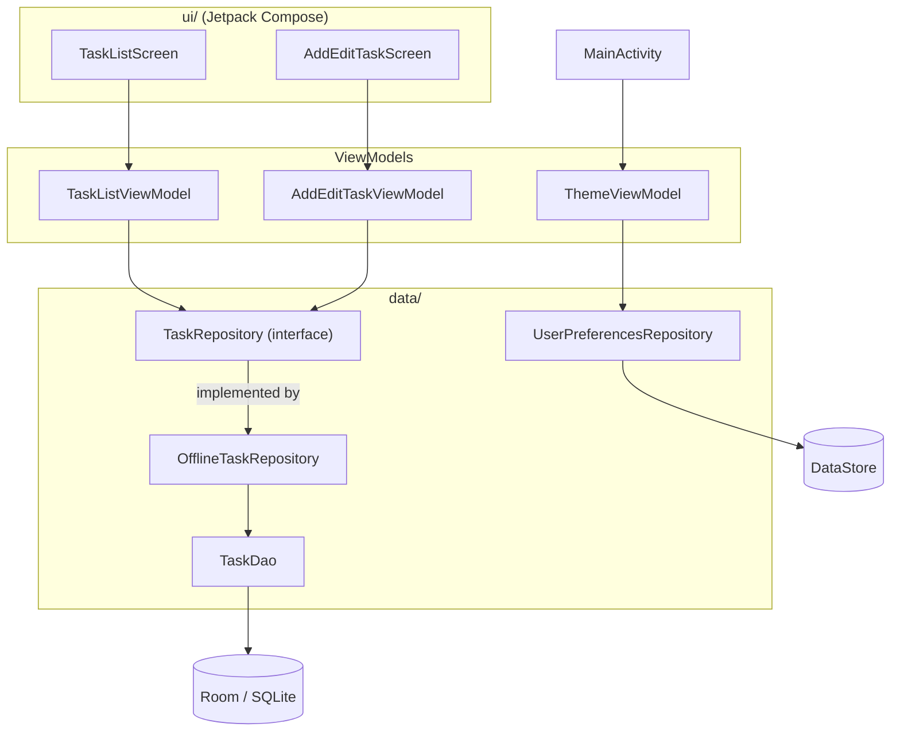

# Todo App

A native Android task manager built with Jetpack Compose, Room, and DataStore. Add, edit, complete, and delete tasks; everything is stored on the device, so it works offline.

<p align="center">
  
  
  
  
</p>

## Features

- **Task list** stored in a local Room database, newest first, with an empty state.
- **Add and edit** tasks on a single screen; tap a task to edit its title.
- **Mark tasks as done** with a checkbox; the state is saved with the task.
- **Swipe to delete** with an **Undo** snackbar that restores the task.
- **Dark mode toggle** that is remembered between launches (Jetpack DataStore), including the status and navigation bar icon colors.
- **Offline by design**: no network, no account.

## Tech stack

- **UI**: Jetpack Compose with Material 3 (`Scaffold`, `LazyColumn`, `SwipeToDismissBox`, `SnackbarHost`), single-activity, edge-to-edge.
- **Navigation**: Navigation Compose 2.9 with string routes and an optional `Long` argument for the add/edit screen.
- **Persistence**: Room 2.8 (KSP) for tasks, Jetpack DataStore Preferences 1.2 for the theme setting.
- **Async**: Kotlin coroutines 1.11 and `Flow` / `StateFlow`; lifecycle-aware collection with `collectAsStateWithLifecycle`.
- **Architecture**: MVVM with a repository, manual dependency injection.
- **Testing**: JUnit 4 and `kotlinx-coroutines-test`.
- Kotlin 2.2, Android Gradle Plugin 9.1, `minSdk` 28, `compileSdk` 36.

## Architecture

MVVM with a thin repository layer and no DI framework: the screens observe ViewModels, the ViewModels talk to a repository interface, and only the repository knows about Room.



- **Repository behind an interface.** ViewModels depend on `TaskRepository`, not on Room, so the unit tests swap in an in-memory `FakeTaskRepository`.
- **Room `Flow` to `StateFlow`.** `TaskListViewModel` turns the DAO's `Flow` into a `StateFlow` with `stateIn(..., WhileSubscribed(5_000))`: it stops collecting shortly after the UI goes away, but survives configuration changes such as rotation.
- **One-off events as a `Channel`, not state.** The "task deleted, undo?" snackbar is sent through a `Channel` exposed as a `Flow`, so it is shown once and not replayed after a rotation.
- **Manual DI.** `TodoApplication` lazily creates the database and repositories; `AppViewModelProvider` builds the ViewModels with `viewModelFactory`. A framework like Hilt would be overkill for an app this size.
- **One screen for add and edit.** `AddEditTaskViewModel` reads the optional `taskId` navigation argument from `SavedStateHandle`: no id means "add", an id means "load that task and edit it".

## Getting started

1. Clone the repository and open it in a recent version of Android Studio (one that supports Android Gradle Plugin 9.1). JDK 17 or newer is required; Android Studio's bundled JDK works.
2. Let Gradle sync, pick an emulator or device running Android 9 (API 28) or newer, and run the `app` configuration.

From the command line:

```sh
./gradlew assembleDebug     # build the debug APK (app/build/outputs/apk/debug/)
./gradlew installDebug      # install it on a connected device or emulator
```

## Tests

```sh
./gradlew test
```

There are 11 unit tests covering the ViewModels' behavior:

- `TaskListViewModelTest` (5): the list mirrors the repository (newest first), toggling completion, deleting a task and emitting the undo event, and restoring a task with undo.
- `AddEditTaskViewModelTest` (6): add mode versus edit mode (including the default `-1` id), trimming the title on save, ignoring a blank title, loading an existing task, and keeping the task's other fields when editing.

Tests run against `FakeTaskRepository` (an in-memory `TaskRepository`) and use a `MainDispatcherRule` to replace `Dispatchers.Main`, so they run on the JVM without an emulator.

## Roadmap

- [ ] Strike through completed tasks and add a "hide completed" filter.
- [ ] Compose UI tests for add, edit, and swipe-to-delete.
- [ ] Unit-test `ThemeViewModel` (needs a test DataStore or an interface over `UserPreferencesRepository`).
- [ ] Due dates and notes (a Room schema migration).

## Project layout

```
app/src/main/java/com/example/myapplication/
  MainActivity.kt            Single activity, theme + edge-to-edge setup
  TodoApplication.kt         Manual DI container (database, repositories)
  data/                      Task entity, TaskDao, TaskDatabase, TaskRepository,
                             UserPreferencesRepository (DataStore)
  ui/
    AppNavHost.kt            Navigation graph and routes
    AppViewModelProvider.kt  ViewModel factory
    ThemeViewModel.kt        Dark mode state
    tasklist/                TaskListScreen, TaskListViewModel
    addedit/                 AddEditTaskScreen, AddEditTaskViewModel
    theme/                   Color, Type, Theme
app/src/test/java/com/example/myapplication/
  FakeTaskRepository.kt      In-memory repository for tests
  MainDispatcherRule.kt      Swaps Dispatchers.Main in tests
  ui/tasklist/               TaskListViewModelTest
  ui/addedit/                AddEditTaskViewModelTest
Screenshots/                 Images used in this README
```
